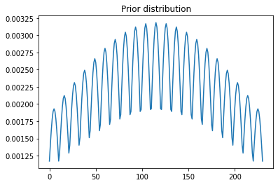
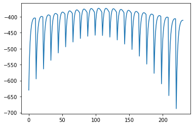
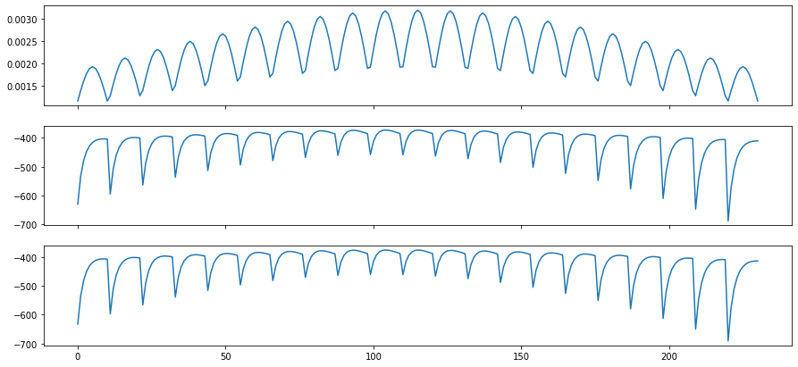

## This is a tutorial for Bayesian inference

The idea behind the Bayesian inference is based up the bayes rule. The mathematical framework of bayes rule is given by $$P(\theta|X) = \frac{P(X|\theta)\cdot P(\theta)}{P(X)},$$ where $$P(X)=\int_\theta P(X|\theta)P(\theta)d\theta.$$ Note that
\begin{align}
P(\theta|X)&\equiv \text{posterior probability}\\
P(X|\theta)&\equiv \text{likelihood}\\
P(\theta)&\equiv \text{prior}\\
P(X)&\equiv \text{normalization}
\end{align}


The idea behind the Bayesian inference is that given the observed data X, we choose a prior distribution of the parameters $P(\theta)$, e.g. a uniform distribution or a normal distribution, and we find the parametesr $\theta$ which maximizes the posterior distribution $P(\theta|X)$. The mathematical expression is:
$$argmax_\theta P(\theta|X)$$
Since $P(X)$ is independent of $\theta$, the question is simplified to $$argmax_\theta P(X|\theta)\cdot P(\theta)$$

In this tutorial, we will go over a toy example to demonstrate how the bayesian inference work based on the bayes rule.

Let's say we would like to estimate the average height of population in a given area. Due to the limited resource, we choose a sample population from that region and try to approach the true mean height in that region. We first generate 100 sample heights from a normal distribution with $\mu=175$, and $\sigma = 10$

## Generating Data


```python
%pylab inline
import scipy.stats as stats
```

    Populating the interactive namespace from numpy and matplotlib


```python
mu = 175
sigma = 10
height = around(np.random.normal(175,10,100),1)
```

## Get Prior $P(\theta)$

We assume that our probailistic model (sampling distribution) follows a normal distribution. In this case, we have two parameters $\mu$ and $\sigma$, and we further assume that the two parameters follows a Guassian distribution with $\mu\sim N(175,10)$ and $\sigma \sim N(10,5)$. The two random variable are not necessarily independent, and the joint pdf of the two random variables is given by 
$$f_{\textbf{X}}(\textbf{x})=\frac{1}{\sqrt{(2\pi)^k|\Sigma|}}\text{exp}\left(-\frac{1}{2}(x-\mu)^T\Sigma^{-1}(x-\mu)\right).$$ 


```python
mu_hat = np.linspace(175-10,175+10,21)
sigma_hat = np.linspace(10-5,10+5,11)
```


```python
cov = array([[100,0],[0,25]])
mu_arr = array([175,10])
```


```python
theta_arr = array([[mu,sig] for mu in mu_hat for sig in sigma_hat])
```


```python
#prior = array([p_mu * p_sig for p_mu in prior_mu for p_sig in prior_sigma])
prior = stats.multivariate_normal.pdf(theta_arr,mean = mu_arr,cov = cov)
```


```python
plot(prior)
title('Prior distribution')
```


    Text(0.5, 1.0, 'Prior distribution')


    

    


## Get likelihood

The pdf of multi-variate normal distribution is given by 
$$f_{\textbf{X}}(\textbf{x})=\frac{1}{\sqrt{(2\pi)^k|\Sigma|}}\text{exp}\left(-\frac{1}{2}(x-\mu)^T\Sigma^{-1}(x-\mu)\right).$$ Here, we assume that each height samples is drawn independently. Then the total probability is given by 
$$P(X|\theta)=\prod_i P(x_i|\theta)$$


```python
likelihood = array([stats.norm.logpdf(height,*theta_arr[i]).sum() for i in range(theta_arr.shape[0])])
```


```python
plot(likelihood)
```


    [<matplotlib.lines.Line2D at 0x7f510df2eaf0>]


    

    


## Obtain the posterior


```python
log_prior = log10(prior)
```


```python
assert (len(log_prior)==len(likelihood))
posterior = log_prior + likelihood
```


```python
theta_arr[argmax(posterior)]
```


    array([174.,  10.])


```python
print("The optimum mu and sigma is mu = %d, sigma = %d" %(theta_arr[argmax(posterior)][0],theta_arr[argmax(posterior)][1]))
```

    The optimum mu and sigma is mu = 174, sigma = 10


```python
fig,ax  = subplots(3,1,sharex=True,figsize=(15,7))
ax[0].plot(prior)
ax[1].plot(likelihood)
ax[2].plot(posterior)
```


    [<matplotlib.lines.Line2D at 0x7f510de79dc0>]


    

    


```python

```
